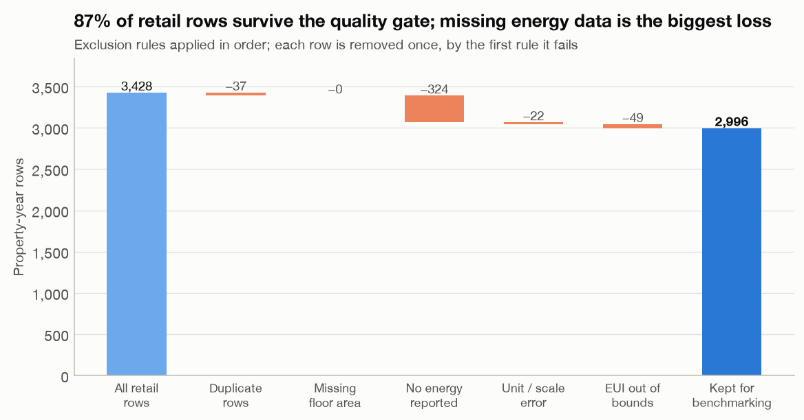
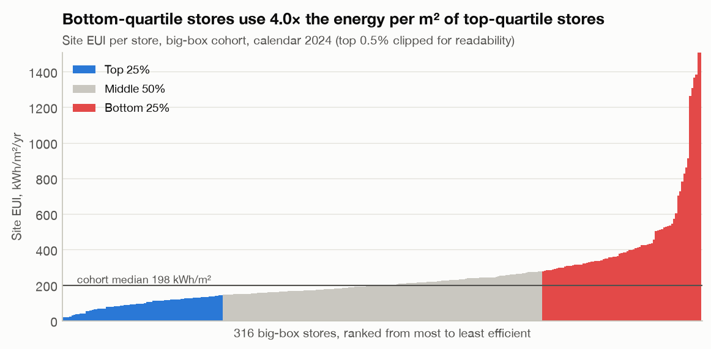
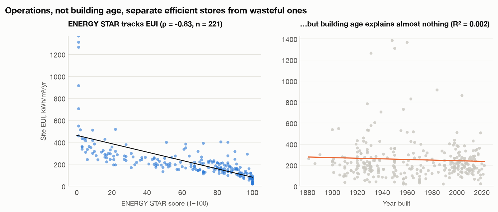
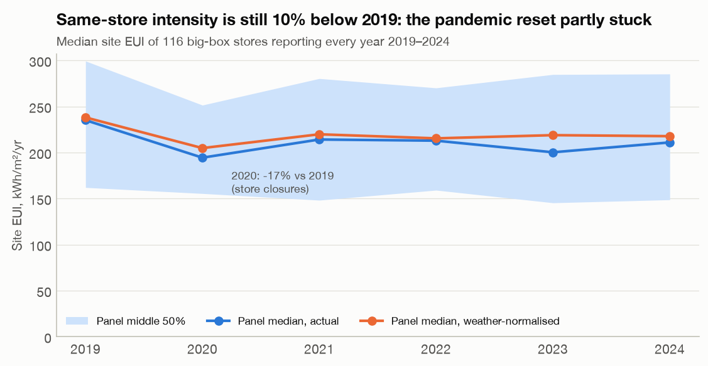
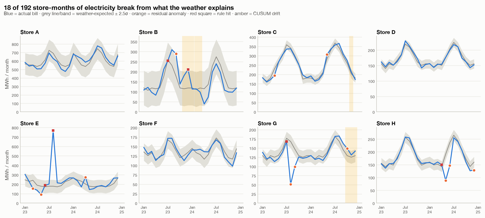
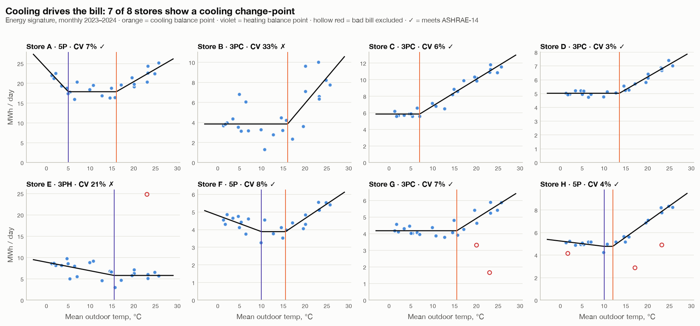
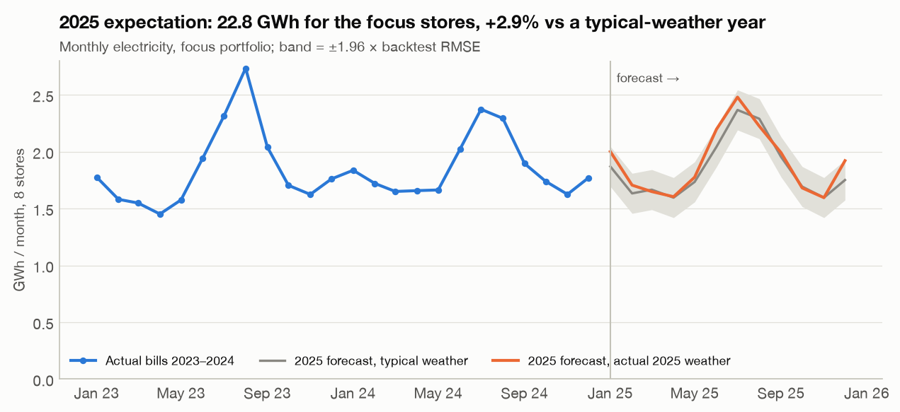
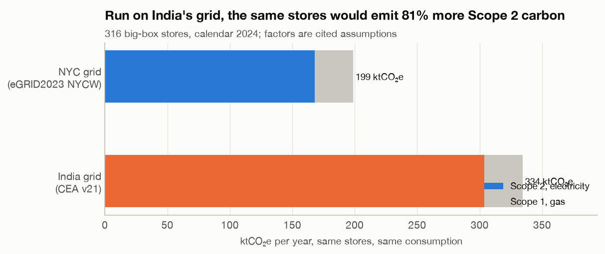
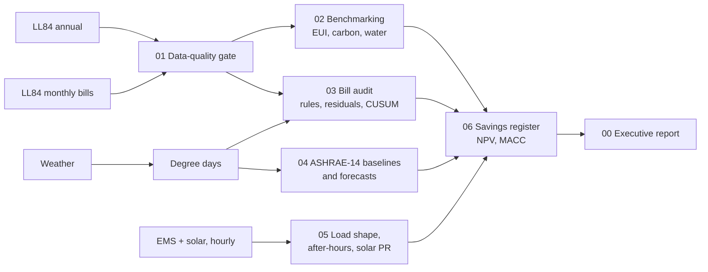

<h1 align="center">Retail Energy & Carbon Analytics</h1>
<p align="center"><b>Finding the wasted energy, wrong bills and cheapest carbon cuts in a portfolio of large retail stores, using real public data.</b></p>

<p align="center">


</p>

<p align="center"></p>

> **In one line:** across 316 large stores, the least efficient quarter uses **4.0× more energy per m²** than the best quarter. Building age doesn't explain it, so the gap comes down to how stores are run. Closing it is a technical potential of **82 GWh of electricity, about $17.3M and 32 kt CO₂e a year.**

---

## The 30-second version
| | |
|---|---|
| **Problem** | An energy team must keep answering: *which stores waste energy, which bills are wrong, what do we fix first, and what is it worth?* |
| **Data** | 1,166 NYC retail buildings' official energy disclosures (2019–2024), 42,264 monthly utility bills, daily weather to 2026-09, plus a real building-management (EMS) and solar dataset |
| **What I built** | A data-quality gate → portfolio benchmarking → automated bill audit → weather-normalised baselines and forecasts |
| **Headline** | 4.0× efficiency gap · 59 facility tickets from 8 stores' bills · $279k of suspicious bills to verify · 6/8 baselines meet the industry M&V standard |
| **Honesty** | Every number on this page is computed by the notebooks and rendered by a script. Every price and emission factor is cited in [`config/assumptions.yaml`](config/assumptions.yaml) |

---

## The story

### Chapter 1: Before trusting any number, trust the data
Public energy data is messy. I built a **10-rule data-quality framework** that catches duplicates, missing floor areas, values typed about **1,000× too large**, implausible intensities, and monthly bills that are missing, flat (estimated) or spiking. Each building gets a **0–100 quality score**, and every exclusion is shown in a waterfall, not quietly dropped.

<p align="center"></p>

**87%** of 3,428 building-years pass the gate. 22 more were removed for unit errors about 1,000× off, enough to wreck any portfolio average. Where both exist, monthly bills add up to within 10% of the annual disclosure for **98.4%** of building-years, so the bills are trustworthy.

### Chapter 2: Who is wasting energy?
I benchmarked every large store on **Energy Use Intensity (EUI)** in both US units (kBtu/ft²) and the kWh/m² used in Europe and India. The median store uses 198 kWh/m² a year. The spread is the story:

<p align="center"></p>

**Bottom-quartile stores use 4.0× the energy per m² of top-quartile stores** (382 vs 96 kWh/m²). Electricity is 73% of a typical store's energy, so it drives carbon too (median 64 kgCO₂e/m²).

### Chapter 3: Is it the building, or how it's run?
If old buildings were the problem, we'd need capital. They aren't: **building age explains R² = 0.002 of the variation**, essentially nothing. The ENERGY STAR score, which reflects how a building operates, tracks EUI closely (ρ = -0.83).

<p align="center"></p>

The pandemic proved operations matter. Among 116 stores that reported every year, intensity fell **17% in 2020** and is still 10% below 2019. Habits that changed under pressure partly stuck.

<p align="center"></p>

### Chapter 4: Which bills are wrong, and which are waste?
For 8 focus stores (picked by rule: largest, cleanest, fully metered) I ran a **three-layer audit** on two years of monthly bills:
1. **Rules**: zero reads, spikes vs neighbouring months, flatlines (estimated bills), sudden level shifts
2. **Weather model**: each store's expected bill for that month's temperature; big residuals are flagged
3. **CUSUM**: catches slow drift that never trips a single-month alarm

<p align="center"></p>

The audit raised **59 facility tickets** with expected vs actual, cost, likely cause and priority. The crucial distinction: **$61k/yr is real energy waste**, while **$279k looks like billing or meter errors** (look at Store E's catch-up bill above). Those need a phone call to the utility, not an engineer, and I don't count them as savings. Scaled to all 69 large stores with complete bills, 64% get at least one ticket.

### Chapter 5: What does the weather explain, and can we forecast?
Using **ASHRAE Guideline 14 change-point regression**, each store gets an *energy signature*: flat base load, then a slope once it's warm enough to need cooling.

<p align="center"></p>

**6 of 8 stores meet ASHRAE-14 calibration** (CV(RMSE) ≤ 15%, |NMBE| ≤ 5%), good enough to verify savings under IPMVP Option C. 7 of 8 have a cooling change-point, so cooling is the swing load.

Then a fair fight: forecast 2024 using only data available at the end of 2023.

| Model | Median store error | Portfolio total error |
|---|---|---|
| Seasonal naive (same month last year) | 14.8% | 5.9% |
| **Change-point + weather** (3 parameters) | **11.1%** | 4.4% |
| LightGBM pooled over 475 stores | 17.3% | **3.6%** |

**No model wins everywhere.** The simple physical model is best store by store; machine learning wins on the portfolio total. The biggest errors came from stores with billing problems, so **cleaning the data beats a bigger model**. With 2025's actual (hotter) weather, the 8 stores should use **22.8 GWh**, +2.9% vs a typical year. That's the benchmark for when 2025 bills are published.

<p align="center"></p>

### What it means beyond New York
Grid carbon changes the value of every kWh saved. Run on India's grid (CEA v21 factor), the same stores would emit **81% more Scope 2 carbon**, so efficiency is worth far more where grids are dirtier.

<p align="center"></p>

### Coming next
* **EMS / BMS & solar PV** ([notebook 05](notebooks/)): hourly load shape, after-hours waste, the COVID *phantom load*, solar performance ratio and fault days
* **Savings register** ([notebook 06](notebooks/)): every measure sized from the analysis, with kWh, $, tCO₂e, payback, NPV, a marginal abatement cost curve and the IPMVP verification plan
* **Executive report** (`00_EXECUTIVE_REPORT.ipynb` + code-free HTML)

---

## The data
| # | Dataset | Coverage | Used | Role |
|---|---|---|---|---|
| D1 | [NYC Local Law 84 energy & water disclosure](https://data.cityofnewyork.us/d/5zyy-y8am) + 3 earlier releases | 2019–2024 (latest published) | 3,428 retail building-years | benchmarking, EUI, carbon, water |
| D2 | [NYC LL84 monthly data](https://data.cityofnewyork.us/d/fvp3-gcb2) | 2018-01 to 2024-12 | 42,264 store-months | bill audit, anomalies, forecasting |
| D3 | [Open-Meteo historical weather](https://open-meteo.com/en/docs/historical-weather-api), NYC | 2018 to 2026-09 | 3,195 days | heating/cooling degree days |
| D4 | [Real EMS/BMS + solar dataset](https://doi.org/10.5061/dryad.73n5tb363) (Engel et al., *Scientific Data* 2025) | 2018–2023, hourly | 749 kWp PV, CHP, chillers | interval load shape, after-hours, solar PR (notebook 05) |
| D5 | Factors & prices: EPA eGRID2023, EPA GHG Hub 2025, CEA v21 (India), UBA (Germany), EIA 2025 prices | latest releases | cited in YAML | carbon and cost |

## How it works


**Methods:** ASHRAE Guideline 14 change-point regression (2P / 3P / 5P) with CV(RMSE) and NMBE checks · robust (MAD) z-scores with iterative outlier trimming · tabular CUSUM · variable-base degree days · pooled LightGBM benchmark · IEC 61724 performance ratio · IPMVP Options A/B/C · NPV, payback, marginal abatement cost · location-based Scope 1 & 2 (GHG Protocol).

**Stack:** Python 3.11 · pandas · DuckDB + Parquet · statsmodels · LightGBM · matplotlib (one colour-blind-safe palette) · pytest.

## Skills demonstrated
| Energy-analyst task | Where it's shown |
|---|---|
| Validate and analyse electricity, gas, water & solar data | Notebooks 01, 02 |
| Track KPIs across many stores, benchmark and forecast | 02 (EUI, quartiles, trends), 04 (baselines, forecasts) |
| Audit monthly utility bills for anomalies, waste & savings | 03 (three-layer audit, facility tickets) |
| Work with EMS/BMS sub-meter data | 05 (register reconciliation, load shape, chiller COP) |
| Calculate EUI, carbon & sustainability metrics | 02 (kBtu/ft² and kWh/m², Scope 1/2, water L/m², India sensitivity) |
| Monitor solar PV performance | 05 (expected vs actual, PR, fault days, self-consumption) |
| Quantify savings in kWh, cost and tCO₂e | 06 (ECM register, NPV, MACC, IPMVP) |
| Keep the energy database accurate | 01 (quality rules, scores, waterfall), DuckDB store, unit tests |

## Repository map
```
config/assumptions.yaml   every price, emission factor and capex assumption, with source URLs
scripts/                  download_data.py (pulls D1-D3) · render_readme.py (writes this page)
src/wattwise/             io · quality · kpis · weather · anomalies · forecast · carbon · savings · ems · viz
notebooks/                01 quality → 02 benchmarking → 03 bill audit → 04 forecasting → 05 EMS/PV → 06 savings → 00 report
reports/figures/          every chart on this page (150 dpi)
reports/results/          computed numbers (JSON) that this README is built from
tests/                    unit tests on synthetic data with known answers
```

## Reproduce it
```bash
python3.11 -m venv .venv && source .venv/bin/activate
pip install -r requirements.txt && pip install -e . --no-deps
python scripts/download_data.py        # NYC data + weather automatically
make notebooks readme                  # or open notebooks/ in Jupyter and Run All
make test
```
The EMS dataset (D4) sits behind a browser check on Dryad: download `reduced_data.zip` from the [dataset page](https://doi.org/10.5061/dryad.73n5tb363) into `data/raw/d4_ems/`.

## Limitations, stated plainly
* The stores are **NYC buildings from public disclosure**, not any single retailer's estate. The EMS site is a **German commercial building**, not a store; ratios measured there are transferred to stores and labelled as such.
* The newest public data is **calendar 2024**. NYC did not publish monthly data for 2022. 2025 is **forecast** with actual 2025 weather, not measured.
* Costs use statewide EIA 2025 average prices, which are conservative for NYC. The quartile-gap value is a *technical potential*, not a forecast saving.
* US (eGRID, EPA), German (UBA) and Indian (CEA) factors are each used only where stated.

---
<p align="center"><sub>Built by Sabarish G · MSc Business Analytics · numbers rendered from code, not typed</sub></p>
